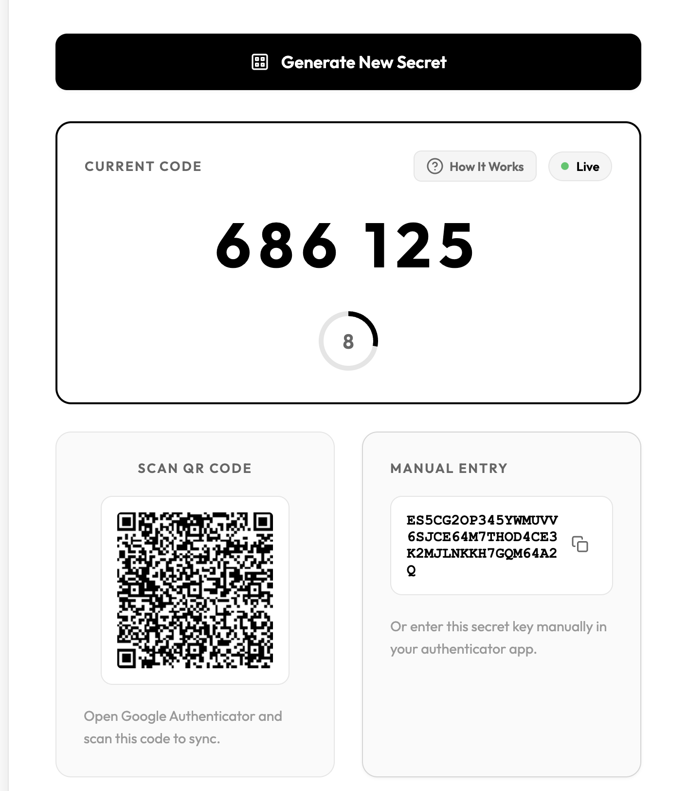
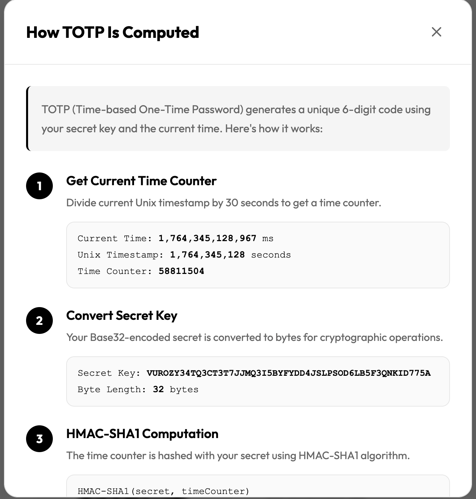

# LiveTOTP

LiveTOTP is a browser-based TOTP (Time-Based One-Time Password) generator built with HTML, CSS, and JavaScript. It lets you generate a secret key, display a QR code for Google Authenticator, and show a live, real-time OTP that updates every 30 seconds. This project is designed both as a fun demo and a learning tool to understand how TOTP works.

## Screenshots

*LiveTOTP working seamlessly with Google Authenticator - see the matching TOTP codes!*

*Step-by-step guide showing how to use LiveTOTP*

## Features

- Generate a random TOTP secret key (Base32)
- Generate a QR code for easy scanning in Google Authenticator
- Display live TOTP codes updating every 30 seconds
- Learn the underlying mechanics of TOTP and QR-based 2FA

## How to Use

1. Open `index.html` in a browser
2. Click "Generate Secret + QR"
3. Scan the QR code using Google Authenticator
4. See the TOTP code update live in the browser—it will match Google Authenticator

## Learning Goals

- Understand how TOTP generates time-based codes
- Learn how QR codes are used to share secrets securely
- See real-time OTP synchronization with authenticator apps
- Practice web development with vanilla JS, HTML, and CSS

## References

- RFC 6238: [TOTP: Time-Based One-Time Password Algorithm](https://tools.ietf.org/html/rfc6238)
- RFC 4226: [HOTP: An HMAC-Based One-Time Password Algorithm](https://tools.ietf.org/html/rfc4226)